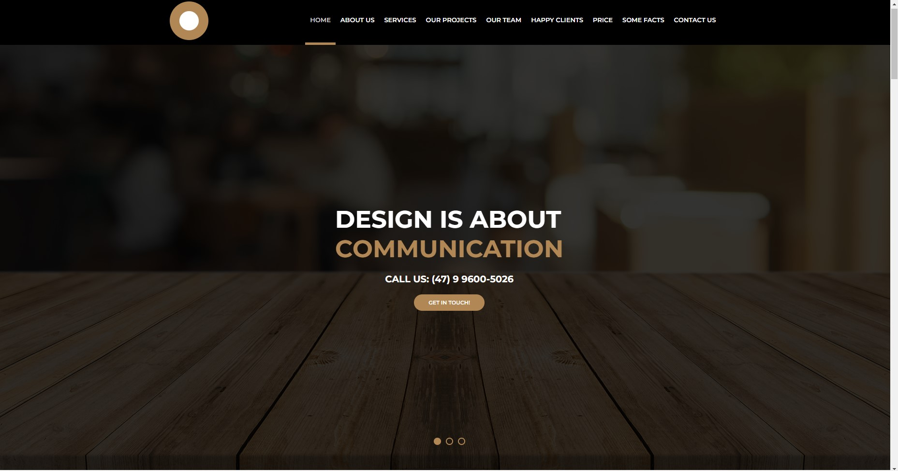
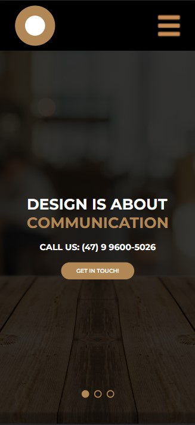

Desenvolvi este site com fins de estudo, pela plataforma B7Web.

Realizei a criação de um site, para exercitar meus conhecimentos em HTML e CSS. Busquei também deixá-lo totalmente responsivo e em tablet e celular usei js para deixar o menu funcional. 
 

<h3>Visualize o projeto no link <a href="https://github.com/RiegL/Projeto_site/" target="_blank"> Prévia publicada </a></h3>

  
Versão Desktop: 

 
Versão Mobilie:
