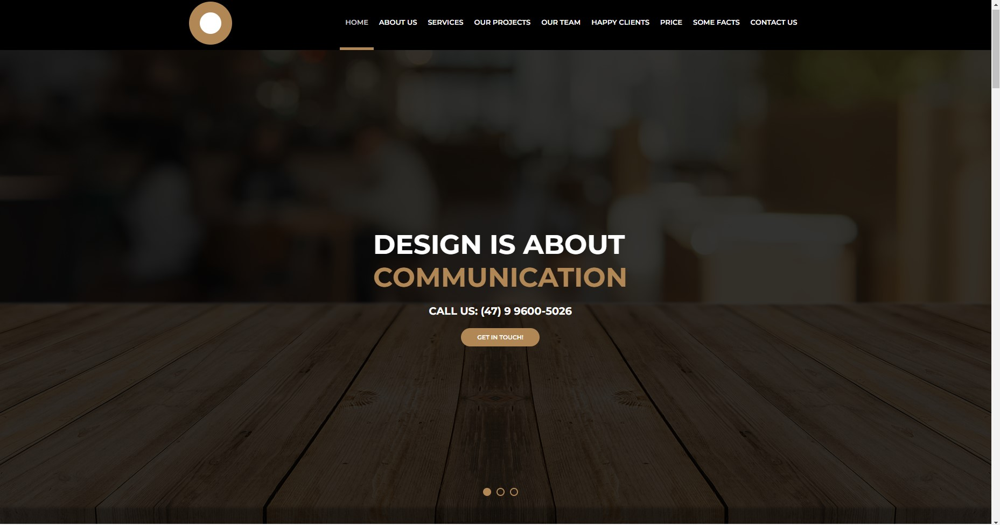

Desenvolvi este site com fins de estudo, pela plataforma B7Web.

Realizei a criação de um site, para exercitar meus conhecimentos em HTML e CSS. Busquei também deixá-lo totalmente responsivo e em tablet e celular usei js para deixar o menu funcional. :heavy_check_mark: 
 

 <h3>Visualize o projeto no link <a href="https://eclectic-dodol-561918.netlify.app/" target="_blank"> Prévia publicada </a></h3> :exclamation:
:heavy_exclamation_mark:

  
Versão Desktop:  

  
Versão Mobilie: 
